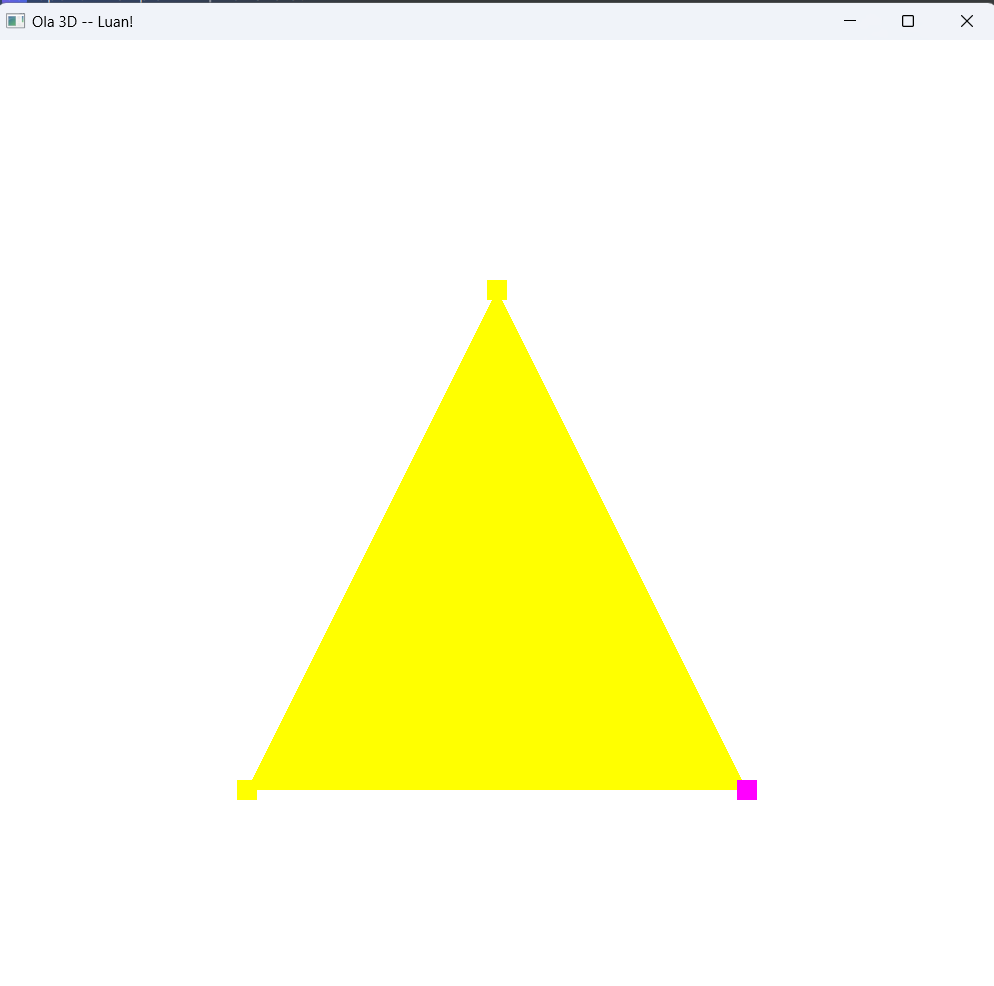
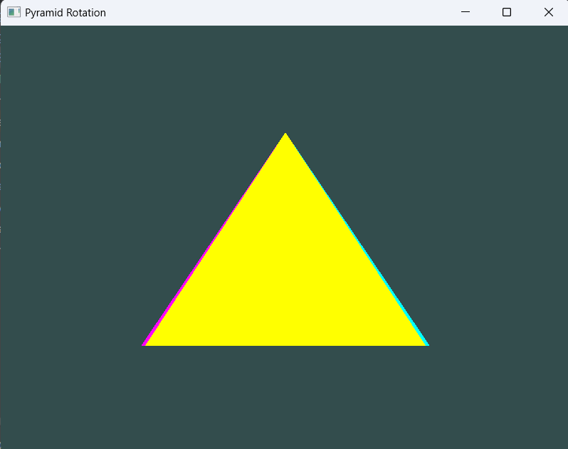

# Processamento Gráfico: Computação Gráfica e Aplicações 2024/2

## Run Project
Para rodar alguma aplicação, deve descomentar ```add_library``` e ```add_executable``` do projeto que
queira executar

Por exemplo:
````cmake
# 0-Hello3D
add_library(glad "${GLAD_DIR}/src/glad.c")
add_executable(OpenGLExample 0-Hello3D/Source.cpp)
````

## Projeto 0: Hello3D
Projeto inicial código pela professora onde exibe uma pirâmide rotacional com pontos nos vértices.



## Projeto 1: Environment3DScenes
Projeto inicial com o propósito para iniciar a projeção 3D com uma pirâmide rotacional automática
e uso de teclado com X, Y e Z para mudar a rotação.


